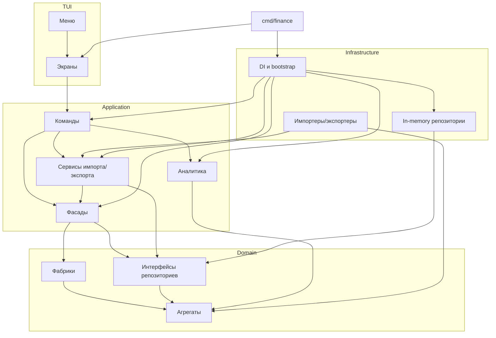

# Finance TUI

## Возможности
- Управление банковскими счетами, категориями и операциями: создание, редактирование, удаление, фильтрация.
- Импорт и экспорт данных в форматы JSON, YAML и CSV.
- Экран операций показывает суммарные доходы, расходы и чистый итог.
- Логирование длительности пользовательских сценариев.
- In-memory хранение данных при запуске приложения.

## Структура
- `cmd/finance` — точка входа, конфигурация и запуск Bubble Tea UI.
- `internal/domain` — агрегаты, value-объекты, фабрики и интерфейсы репозиториев (доменный слой DDD).
- `internal/application`
  - `facade` — фасады над доменными сервисами (слой приложений DDD).
  - `command` — команды, декораторы и сценарии (accounts, categories, operations, files, analytics).
  - `files` — сервисы импорта/экспорта и описания форматов.
  - `analytics` — расчёт Totals по операциям (доходы, расходы, разница).
- `internal/infrastructure`
  - `repository/memory` — in-memory реализации репозиториев.
  - `files` — импортеры/экспортеры конкретных форматов.
  - `di` — контейнер зависимостей и bootstrap (инфраструктура, домен, приложение, команды, UI).
  - `id` — генератор ULID для фабрик доменных сущностей.
- `internal/tui` — Bubble Tea UI: экраны, меню, стили.
  - `program.go` управляет стеком экранов: активный экран всегда на вершине, команды `Push/Pop/Replace` меняют навигацию.
  - `context.go` прокидывает зависимостей экранам (команды, `context.Context`).
  - Пакет `menus` упрощает сборку экранов-форм и списков из меню-элементов.
- `internal/files/model` — DTO для файловых операций.

## Паттерны и подходы
- **DDD** — разделение на слои domain/application/infrastructure/tui, фасады выступают application services.
- **Фасад** — `internal/application/facade/*`, аналитический фасад `internal/application/analytics`.
- **Команда** — `internal/application/command/*` описывает пользовательские сценарии.
- **Декоратор** — `internal/application/command/decorator/timed.go` измеряет длительность команд.
- **Шаблонный метод** — `internal/application/files/import/service.go` определяет общий алгоритм импорта.
- **Стратегия** — `internal/application/files/import.Service` и `.../export.Service` выбирают реализацию по ключу формата (JSON/YAML/CSV).
- **Посетитель** — `internal/application/files/export/visitor.go` и конкретные экспортеры обрабатывают сущности при экспорте.
- **Фабрика** — `internal/domain/factory/*.go` создают агрегаты с валидацией.
- **Прокси (потенциал)** — in-memory репозитории могут быть расширены до прокси над постоянным хранилищем (кэш + БД).
- **Service Locator / Singleton-per-type** — `internal/infrastructure/di/container.go` хранит созданные инстансы и возвращает одну копию зависимости на тип (репозитории, фасады, сервисы).

## Диаграмма зависимостей


## Запуск
```bash
go run ./cmd/finance
```
- Логи таймингов пишутся в `cmd/finance/logs/timings.log` (каталог создаётся автоматически).
- Экран списка операций показывает агрегированные суммы доходов/расходов/чистого итога.
- Экспортированные файлы — JSON, YAML или CSV; импорт поддерживает те же форматы.

## Навигация по TUI
- Клавиши: `↑/↓` — перемещение по пунктам, `Enter` — подтвердить действие, `Esc` — шаг назад или выход.
- Главное меню: пункты «Счета», «Категории», «Операции», «Работа с файлами», «Выход».
- Счета: просмотр списка с переходом к редактированию конкретного счёта и форма добавления нового; баланс проверяется на неотрицательное значение.
- Категории: вывод текущих категорий с возможностью правки и создание новой записи (тип доход/расход выбирается при вводе).
- Операции: доступ к фильтру (период, тип, счёт, категория), создание новой операции и редактирование существующих; после загрузки списка сверху отображается блок аналитики с суммами доходов, расходов и чистой разницей для выбранной выборки.
- Работа с файлами: запуск экранов импорта (JSON/YAML/CSV) и экспорта; после импорта показывается статистика созданных/пропущенных сущностей.

## Форматы файлов
- JSON/YAML: структура соответствует `internal/files/model.Payload`. Поля `accounts`, `categories`, `operations` содержат массивы с идентификаторами (строки), суммами (`int64`), датами (`RFC3339`).
- CSV: каждая строка описывает объект; поле `entity` принимает значения `account`, `category`, `operation`. Счёта включают `id,name,balance`, категории — `id,type,name`, операции — `id,type,bank_account_id,category_id,amount,date,description`.
- Примеры: в `cmd/finance/storage` лежат образцы JSON/YAML/CSV, которые можно использовать как шаблон.
