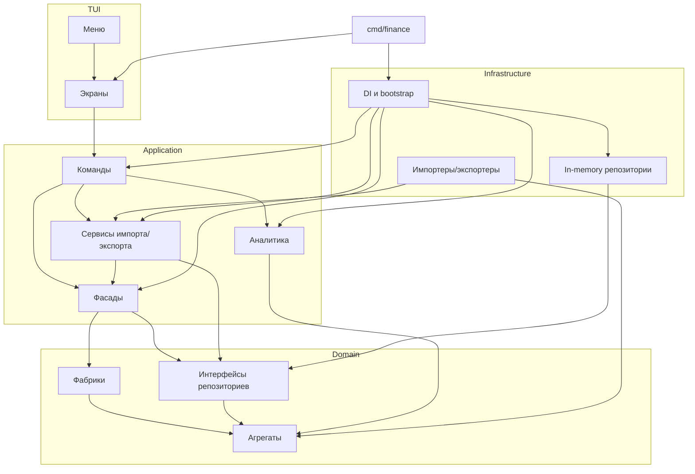

# Finance TUI

## Возможности
- Управление банковскими счетами, категориями и операциями: создание, редактирование, удаление, фильтрация.
- Импорт и экспорт данных в форматы JSON, YAML и CSV.
- Экран операций показывает суммарные доходы, расходы и чистый итог.
- Логирование длительности пользовательских сценариев.
- In-memory хранение данных при запуске приложения.

## Структура
- `cmd/finance` — точка входа, конфигурация и запуск Bubble Tea UI.
- `internal/domain` — агрегаты, value-объекты, фабрики и интерфейсы репозиториев (доменный слой DDD).
- `internal/application`
  - `facade` — фасады над доменными сервисами (слой приложений DDD).
  - `command` — команды, декораторы и сценарии (accounts, categories, operations, files, analytics).
  - `files` — сервисы импорта/экспорта и описания форматов.
  - `analytics` — расчёт Totals по операциям (доходы, расходы, разница).
- `internal/infrastructure`
  - `repository/memory` — in-memory реализации репозиториев.
  - `files` — импортеры/экспортеры конкретных форматов.
  - `di` — контейнер зависимостей и bootstrap (инфраструктура, домен, приложение, команды, UI).
  - `id` — генератор ULID для фабрик доменных сущностей.
- `internal/tui` — Bubble Tea UI: экраны, меню, стили.
  - `program.go` управляет стеком экранов: активный экран всегда на вершине, команды `Push/Pop/Replace` меняют навигацию.
  - `context.go` прокидывает зависимостей экранам (команды, `context.Context`).
  - Пакет `menus` упрощает сборку экранов-форм и списков из меню-элементов.
- `internal/files/model` — DTO для файловых операций.

## Паттерны и подходы
- **DDD** — разделение на слои domain/application/infrastructure/tui, фасады выступают application services.
- **Фасад** — `internal/application/facade/*`, аналитический фасад `internal/application/analytics`.
- **Команда** — `internal/application/command/*` описывает пользовательские сценарии.
- **Декоратор** — `internal/application/command/decorator/timed.go` измеряет длительность команд.
- **Шаблонный метод** — `internal/application/files/import/service.go` определяет общий алгоритм импорта.
- **Посетитель** — `internal/application/files/export/visitor.go` и конкретные экспортеры обрабатывают сущности при экспорте.
- **Фабрика** — `internal/domain/factory/*.go` создают агрегаты с валидацией.
- **Прокси (потенциал)** — in-memory репозитории могут быть расширены до прокси над постоянным хранилищем (кэш + БД).

## Диаграмма зависимостей


## Запуск
```bash
go run ./cmd/finance
```
- Логи таймингов пишутся в `cmd/finance/logs/timings.log` (каталог создаётся автоматически).
- Экран списка операций показывает агрегированные суммы доходов/расходов/чистого итога.
- Экспортированные файлы — JSON, YAML или CSV; импорт поддерживает те же форматы.
